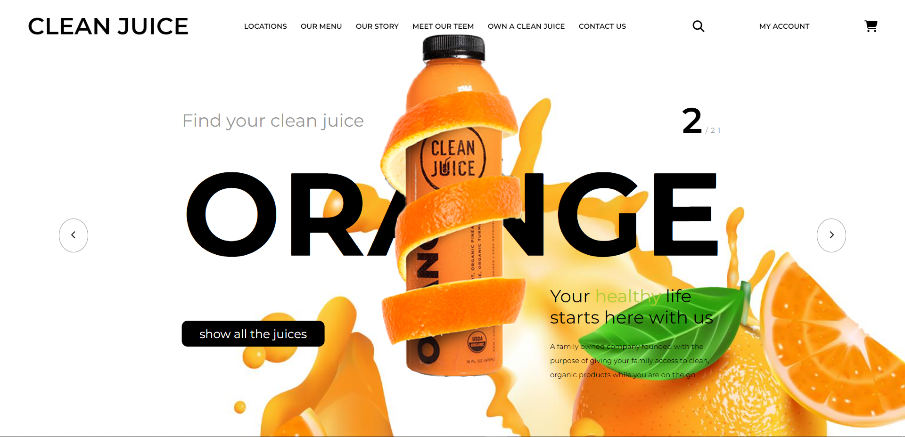

# Clean Juice Website

This repository contains the source code for a simple and stylish website for Clean Juice, a family-owned company focused on providing clean, organic products for families on the go. The website features a modern design with smooth animations and parallax effects.

## Preview



## Demo

You can view the live demo of the Clean Juice Website [here](https://frontend-projects-tau.vercel.app/).

## Technologies Used

- HTML
- CSS
- JavaScript
- [GSAP (GreenSock Animation Platform)](https://greensock.com/gsap/)
- [Parallax.js](https://github.com/wagerfield/parallax)

## Project Structure

- **index.html**: The main HTML file containing the structure of the website.
- **style.css**: The CSS file defining the styles for the website.
- **app.js**: The JavaScript file handling animations and interactions.
- **assets/**: Directory containing images used in the project.

## Getting Started

To view the website locally, simply open the `index.html` file in a web browser.

```bash
# Clone the repository
git clone https://github.com/brohit22/Frontend-Projects.git

# Navigate to the project directory
cd Frontend-Projects

# Open the index.html file in your preferred browser
```

## Features

- Responsive navigation bar with a Clean Juice logo and menu links.
- Stylish animations and transitions powered by GSAP.
- Parallax effect on leaves in the background.
- Engaging content layout with a tagline, page indicator, title, and description.
- Floating juice animation with a subtle bobbing effect.

## Usage

Feel free to customize and use this project as a starting point for your own website. Update the content, modify the styles, and enhance the functionality according to your requirements.

## Credits

- Fonts: [Montserrat](https://fonts.google.com/specimen/Montserrat)
- Icons: [Font Awesome](https://fontawesome.com/)
- Animation Libraries: GSAP, Parallax.js
